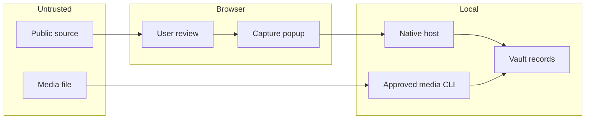

# Research Capture threat model

**DRAFT / conditional:** requested installation/context confirmation is pending. This is not a completed independent security audit or an attestation of absence of malicious code. Prepared 2026-09-22 from current source.

## Executive summary

The most consequential boundary is a user-triggered browser extension gaining local vault-write access. Native messaging avoids an HTTP listener, but an authorized or compromised extension can still submit misleading public-looking evidence. Strict schemas, fixed paths, literal note rendering and review reduce that risk; they cannot prove the user has lawful capture rights or prevent all PII in visible copy/screenshots. The optional CLI media decoder has a separate untrusted-file risk.

## Scope and assumptions

- Single-user macOS Chrome on this Mac and separately configured Mac Mini; no shared web service, no cloud publish, no automatic paid calls.
- Only public, explicitly reviewed evidence. Meta capture requires an isolated logged-out browser. No Instagram page access.
- The intended main-vault destination is `Research Capture`.
- Native host owner-only config and caller origin establish local access scope, not an OS sandbox against a compromised same-user process.
- Out of scope: Chrome/OS compromise, Obsidian sync security, platform-account auth, malicious browser extensions with their own broad permissions, live Jev acceptance and production publishing.
- **Pending validation:** approval to register/load the extension and its intended vault destination. Asked in the current task before installation. Changing tenancy, destination, or network exposure requires revisiting the model.

## System model

### Primary components

`extension/popup.js` controls explicit capture and native submission; `extension/extract.js` reads visible top-frame evidence. `companion/host.py` validates the exact configured caller origin and request frame. `companion/core.py` constrains schema/storage. `companion/media.py` also serves the explicit v0.2 workflow command behind locally approved host/network settings. `scripts/install.py` creates local registration and an installation-specific receipt key.

### Data flows and trust boundaries

- Public page → isolated content function: page-provided strings/URLs only, explicit activeTab invocation, origin allowlist and Instagram precheck. Content remains untrusted.
- Popup → native host: Chrome stdio messaging, exact extension origin, known command allowlist, four-MB frame cap. No network listener, CORS or bearer key.
- Native host → vault: canonical configured root, generated hex IDs, symlink/containment checks, private permissions, exclusive file creation, lock and staged directory rename. Source strings never choose paths or commands.
- Local operator → media CLI → public HTTPS: separate explicit approval flags, exact host, public-IP check plus pinned connection, normal TLS verification, no cookies/proxies/redirects, timeout/MIME/size cap.
- Authorized local media → ffprobe/ffmpeg/Whisper: subprocess argument arrays, no shell, local file/pipe protocol restriction, bounded duration/timeouts, local model. This is not a hardened codec sandbox.
- Vault → Obsidian/agent reader: code-fenced source fields and explicit untrusted-evidence notice. Hashes bind locally received evidence; they do not establish source truth.

#### Historical v0.1 diagram (v0.2 command expansion is below)

## Assets and security objectives

| Asset | Why it matters | Objective |
|---|---|---|
| Vault content | Research and unrelated private notes must not be overwritten | C/I |
| Browser session | Real-account cookies and private pages must not leak | C |
| Source provenance | Users/agents must distinguish claims, evidence and missing data | I |
| Local receipt key | Must not enter extension, notes or package | C/I |
| Compute/storage | Malformed pages/media must not cause unbounded work | A |

## Attacker model

### Capabilities

A hostile public page can change visible text, links, layout and media URLs, inject misleading instructions into evidence, and cause navigation races. A user can accidentally confirm a private page or wrong rights basis. An untrusted media file can exercise codec bugs. A compromised authorized extension can forge capture packets within the allowed protocol.

### Non-capabilities

Ordinary public pages cannot call the native host directly, obtain the receipt key, or invoke any native command directly without the configured extension origin. No web-accessible extension resources, external messaging listener, network listener, cookie API or browser-debugger permission is provided. Same-user local malware is outside this boundary and can still read user-owned files.

## Entry points and attack surfaces

| Surface | Reached by | Boundary | Notes | Evidence |
|---|---|---|---|---|
| Explicit DOM preview | Human click | Page → extension | Read-only selectors, editable result | `extractVisible`, `popup.js` |
| Manual fields | Human input | Popup → validation | Unknown fields rejected | `core.validate` |
| Optional screenshot | Human consent | Viewport → vault | Can include PII; no automatic OCR privacy proof | `popup.js`, `validate_png` |
| Native stdio | Chrome origin | Extension → filesystem | Strict frame and command set | `host.main`, `dispatch` |
| Installer | Local CLI | Operator → permission config | Dry-run default | `scripts/install.py` |
| Media workflow/CLI | Approved native command or CLI | Network/file → decoder | Explicit, exact-host allowlist, network off by default | `media.download`, `transcribe` |
| Test/dependency tooling | Developer | Registry → dev environment | jsdom dev-only, install scripts disabled | `package-lock.json` |

## Top abuse paths

1. Malicious page embeds instructions → saved source text is later mistaken for system instructions → downstream agent takes unauthorized action. Controls: literal evidence and no automatic agent invocation; downstream review remains necessary.
2. User captures authenticated/private context → screenshots reveal data → vault sync propagates it. Controls: explicit public/rights confirmation, Meta isolation attestation, no account automation; attestation is not proof.
3. Crafted packet supplies path/command → host overwrites arbitrary file or executes code. Controls: exact schema/commands, generated paths, no arbitrary shell or network proxy in host; explicit configured adapters only.
4. Malicious media URL resolves to LAN → downloader reaches internal service. Controls: HTTPS exact host, all-address public check, pinned IP, no redirects/proxy.
5. Untrusted media exploits codec → local user compromise. Controls: explicit local workflow/CLI, duration/size/time caps, protocol restrictions; stronger process sandbox remains a future mitigation.
6. Oversized/replayed evidence → disk growth or altered observation → misleading or unavailable corpus. Controls: frame/text limits, exact dedupe, capture-ID digest binding, per-minute rate gate, explicit failures. No global disk quota yet.
7. Tampered record → hash/receipt mismatch ignored → false confidence in evidence. Controls: independent SHA-256 and local HMAC verifier; readers must actually run them.

## Threat model table

| ID | Source | Prerequisites | Action | Impact | Assets | Existing controls | Gaps | Recommended mitigation | Detection | Likelihood | Severity | Priority |
|---|---|---|---|---|---|---|---|---|---|---|---|---|
| TM-001 | Hostile page | User saves source | Inject tool instructions into evidence | Downstream unauthorized action | Vault/agent integrity | Fenced literals; no automatic evaluator | Readers may ignore boundary | Enforce evidence-only downstream contract | Review trace | medium | high | high |
| TM-002 | User error/page | Private content confirmed | Capture PII in text or screenshot | Sensitive data copied into vault | Confidentiality | No cookies/forms API; consent and redaction regex | Regex not comprehensive PII scanner; screenshots not inspected | Keep screenshot off by default; explicit human review | Capture preview/receipt | medium | high | high |
| TM-003 | Forged packet | Authorized extension compromised | Inject path/command | Arbitrary local mutation | Filesystem integrity | Fixed root, known commands, generated IDs, symlink checks | Same-user compromise out of scope | Maintain small native API, regression tests | Rejected request/failed UI | low | high | medium |
| TM-004 | Media URL | Operator approves hostile host | DNS rebinding/redirect to LAN | Internal fetch | Network confidentiality | All-IP check, pin, TLS, no redirects | Direct URL may still be tracking | No credentials and minimal request headers | CLI failure manifest | low | high | medium |
| TM-005 | Media file | Operator imports and decodes | Exploit ffmpeg/Whisper | Same-user execution | Local files | Explicit CLI; bounded subprocess, file-only protocols | No OS codec sandbox/security certification | Use dedicated low-privilege media worker before broad intake | Process error/timeout manifest | medium | high | high |
| TM-006 | Repeated caller | Can invoke native host | Fill disk via new captures/duplicates | Local availability | Disk | Frame caps, rate limit, generated files | No global quota; retained receipts accumulate within rate limits | Add quota and reviewed retention policy before high volume | Directory size/receipt count | medium | medium | medium |
| TM-007 | Record tampering | Can edit user files | Modify copied evidence | Misleading research | Integrity | Artifact SHA-256, HMAC, cold verifier | Local key can be read by same-user malware | OS account protection; verify before decisions | Integrity check fails | low | medium | low |

## Criticality calibration

- Critical: remote arbitrary code via a public page into native host; unauthenticated arbitrary vault-write endpoint. Neither is an intended interface.
- High: private screenshot leakage; codec execution from imported media; downstream privileged action from quoted instructions.
- Medium: bounded local disk exhaustion; forged evidence from an already authorized extension; manually approved suspicious media host.
- Low: missing optional metadata; a visibly partial capture; blocked navigation without data loss.

## Focus paths for security review

| Path | Why | Threats |
|---|---|---|
| `extension/popup.js` | Consent, tab freshness, origin and Instagram gates | TM-001/002 |
| `extension/extract.js` | Visible/private-content boundaries and ambiguous ad refusal | TM-001/002 |
| `companion/host.py` | Exact origin, framing and command set | TM-003/006 |
| `companion/core.py` | Validation, path safety, rendering, dedupe, integrity | TM-003/006/007 |
| `companion/media.py` | SSRF, TLS pinning and untrusted codec execution | TM-004/005 |
| `scripts/install.py` | Scope of native registration and owner-only key | TM-003/007 |

## Notes on use

All discovered runtime entry points and trust boundaries are covered above; development dependencies are distinct from runtime. Threat ranking assumes a single local operator and public sources. Installation/context approval and real Chrome tests remain pending. npm audit reported zero known dependency advisories at the test date; this is not a full security scan or proof the system is safe. No claim of NVIDIA certification or compliance is made.

## v0.2 superseding addendum — two-mode native boundary

**Read this instead of older statements that the native host cannot download or spawn media decoders.** `workflow` is now an explicitly user-triggered command. It can call bounded exact-host public HTTPS download/landing adapters and fixed local ffprobe/ffmpeg argument arrays. No shell or arbitrary URL proxy is exposed. Network stays disabled by default in local config; live configuration/registration is still approval-gated. The earlier CLI-only diagram describes v0.1, not the expanded command surface.

New controls: separate Downloads/vault roots; no Store initialization for quick mode; exclusive collision-safe filenames; 20 workflow attempts/minute; source-specific immutable packages with HMAC/hash readback; duplicate tamper rejection; static escaped CSP-constrained research report; no model transport and no automatic paid scraper. Instagram active-tab source autofill is disabled and all media capture requires an explicitly reviewed external non-browser import. Failed upstream receipt, unknown adapter, wrong hash and escaping path fail closed. Receipt fields attest upstream behavior but cannot prove it; manually review actual canonical-run provenance.

New risks: a compromised permitted extension could request approved-host transfers; origin allowlisting is not a sandbox against same-user malware; allowlisted sites can host hostile media or copyrighted/private material; DOM visibility and publicness are imperfect; codec vulnerabilities remain despite time/size/protocol caps. Native pipe/UI lifetime, media transfer performance and real browser extraction require live acceptance. No host rule should be widened to accept Instagram network/DOM observation. No unrestricted yt-dlp/browser fallback is added. No automatic provider dispatch or platform-specific downloader is claimed.

Mitigations and evidence: tests/test_workflows.py exercises quick-mode no-vault writes, name collisions, MP3 fixture conversion, complete/partial/missing-LP/model-failure packages, dedupe/changed creatives, corrupted-file refusal, source/host/private-IP/Instagram blocks and explicit non-browser receipt import. tests/popup.test.js checks active-Instagram refusal and external-paste no-DOM/no-screenshot behavior. scripts/verify_workflow_fixtures.py separately verifies generated hashes and source separation. Tests are not a guarantee against all malicious content. Stronger OS-level decoder sandbox and authentic upstream receipt signing remain future hardening.

### Jev CLI addition
A separate server-side one-call CLI is implemented with dry-run default, dedicated key only, fixed endpoint, redirect/proxy rejection, bounded response/time, request-hash receipt binding and sanitized failures. It is not callable from page content or the native browser command. Tests mock transport; no paid call was made. Actual provider compatibility, credential/data authorization and costs remain a live-call gate.
